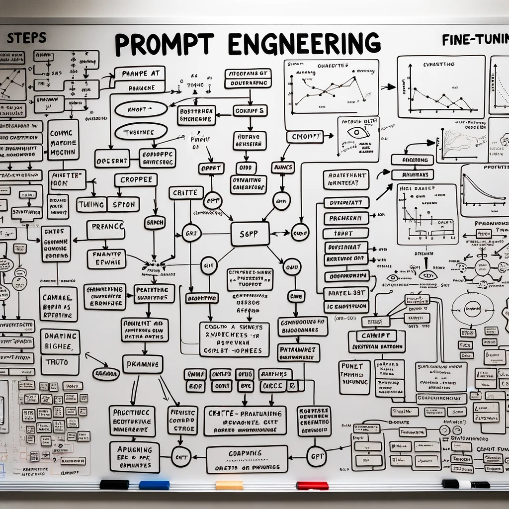

# finetuning-openai

## Prompt Engineering vs Fine-Tuning for Stock Price Predictions
This repo contains code and examples from my blog post on using prompt engineering and fine-tuning with GPT models for stock price predictions.

## Overview
In this post, I dive deep into the fine-tuning of language models and prompt engineering, using the problem setting of stock price prediction based on high-frequency OHLC stock price data for AAPL.

I demonstrate that fine-tuning, especially with models like GPT-3.5 Turbo, is the stronger approach. The ability to train a model on specific data, such as price sequences, enhances its understanding and predictive power for those unique use cases.

## Key topics covered:

- Formatting stock price data for fine-tuning
- Training loops and hyperparameters
- Monitoring training progress
- Generating predictions from a fine-tuned model
- Engineering effective prompts with context
- Token limits and other challenges of prompting
- Using ChatGPT's advanced data analysis plugin

## Code:

Various Python scripts support the work reported in the post:

- createfile.py - Reads the first 100,000 lines from an input file df_data_AAPL.txt and writes them to a new output file 100000_lines_AAPL.txt.
- finetuning.py - Formats a raw CSV stock price dataset into JSONL, uploads it to OpenAI, and creates a fine-tuning job to train a GPT-3.5 model on predicting stock prices.
- preds.py - This code extracts stock price sequences from a CSV, constructs prompts to get hypothetical continuations from GPT-4, and prints the predicted next values.

## References

- **OpenAI Documentation.** "Fine-tuning." [\<https://platform.openai.com/docs/guides/fine-tuning\>](https://platform.openai.com/docs/guides/fine-tuning)
- **OpenAI Documentation.** "API reference." [\<https://platform.openai.com/docs/api-reference/fine-tuning\>](https://platform.openai.com/docs/api-reference/fine-tuning)
- **OpenAI Updates.** "GPT-3.5 Turbo fine-tuning and API." [\<https://openai.com/blog/gpt-3-5-turbo-fine-tuning-and-api-updates\>](https://openai.com/blog/gpt-3-5-turbo-fine-tuning-and-api-updates)
- **OpenAI Documentation.** "DALL·E 3." [\<https://openai.com/dall-e-3\>](https://openai.com/dall-e-3)
- Refer to the original post <a href="https://johncollins.ai/finetuning-openai" target="_blank">Prompt Engineering vs. Fine-Tuning: Navigating GPT Models for Stock Price and Volatility Predictions</a> for additional details and examples.
